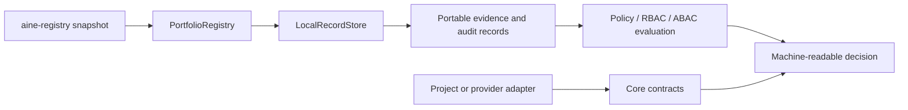

# Public architecture boundary

## Position

`aine-control-plane-core` sits between portable artifacts produced by
`aine-registry` and an application-specific control plane. It defines data and
decision contracts, but it does not own a hosted application or a repository.

## Public modules

| Module | Responsibility | Boundary |
| --- | --- | --- |
| `contracts.py` | adapter protocols, context, metadata | no provider SDK or transport |
| `outcomes.py` | portable success/failure/unknown/conflict envelope | preserves uncertainty |
| `config.py` | serializable adapter configuration | credential references plus structural secret/path guards; opaque values remain adapter-specific |
| `validation.py` | contract, record, config, path, and digest validation | evidence-backed structural checks |
| `integration.py` | portable Orvena/airt report-only observation contract | digest + normalized claims; no native payload or mutation |
| `store.py` | append-only SQLite records/events and export | writes only its configured store |
| `portfolio.py` | Registry snapshot ingest, relationship/source-of-truth views, and impact | does not rescan repositories |
| `governance.py` | policy plus deterministic RBAC/ABAC decisions | evaluates; does not enforce external systems |
| `retention.py` | retention recommendations | never deletes |
| `adapters/` | local and deterministic reference adapters | no network/provider dependency |

## Deliberate non-goals

The public core does not include UI, HTTP serving, authentication, GitHub
integration, secret resolution, deployment, source editing, agent execution,
approval workflow orchestration, or hosted multi-tenant state. Those are
application and adapter concerns and must establish their own trust boundary.
File-backed reference adapters have no source-repository handle, but callers
must configure their destinations outside scanned repositories.

`PortfolioRegistry.relationships()` and `PortfolioRegistry.source_of_truth()`
query only records already persisted from a portable Registry snapshot. They do
not infer runtime semantics or rescan source repositories. `impact()` includes
matching dependency edges and explicitly impact-bearing relationships for the
requested project, but only known Registry projects are returned in
`affected_projects`; unresolved external providers remain evidence on the
matching edge. Topology-only `portfolio`, `governance`, and `integration` edges
remain available through `relationships()` without expanding the change
boundary unless the manifest sets `impact: true`.

## Report-only producer integration

`integration-observation.v1` is the public wire contract for evidence received
from Orvena or airt. A record carries `producer`, `project_id`, native
`run_id`/`native_schema`, a shared `correlation_id`, and the Registry
`snapshot_id` used as its portfolio context. The adapter states which native
format it digested; the core does not name a producer's format on its behalf,
because a producer that publishes no portable export has no identifier to
assert. Adapters digest the native report and copy only normalized claims; raw
payloads, credentials, absolute paths, and execution authority stay outside the
core. The private consumer must ingest the
referenced snapshot before persisting the observation. This is a reporting
link, not a runner start, policy grant, approval transition, or mutation API.

Where a producer publishes no portable export, the reference adapter names its
own projection instead. `AirtChainProjectionAdapter` reduces an airt run to
`aine.control-plane.airt-chain-projection.v1`: sequence, direction, method,
argument digest, and event hash, with every other field dropped by allow-list
and reported in the outcome. The name is in this namespace because the shape
belongs to this core, and the identifier is a constant because `evidence_id`
is derived from it. The adapter never opens airt's event database; callers
read the run and pass it in. Its outcome reports the collection while the
observation reports the run, so a denied tool call is a `failure` observation
carried by a `success` outcome.

## Compatibility

The package release version is independent from the wire identifiers; the
current release is `0.2.0`. Portable contract identifiers remain
`aine.control-plane.*.v1`; consumers should pin and test the wire schemas
independently from the Python package version.

The v0.2.0 additions are backwards-compatible query capabilities: explicit
relationship records are validated when present, `impact-report.v1` adds an
optional `source_of_truth` array, and source-of-truth queries use the latest
observed declaration for a stable `source_rule_id`. A missing declaration is
not treated as a tombstone because snapshots are append-only observations;
existing dependency records remain accepted under the prior ingest boundary.

The `integration-observation.v1` contract is additive: consumers
that do not use Orvena/airt observations remain unchanged. Its validator is
portable and dependency-free, and producers remain responsible for exporting
their native evidence without importing this package.
