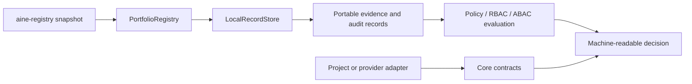

# Public architecture boundary

## Position

`aine-control-plane-core` sits between portable artifacts produced by
`aine-registry` and an application-specific control plane. It defines data and
decision contracts, but it does not own a hosted application or a repository.

## Public modules

| Module | Responsibility | Boundary |
| --- | --- | --- |
| `contracts.py` | adapter protocols, context, metadata | no provider SDK or transport |
| `outcomes.py` | portable success/failure/unknown/conflict envelope | preserves uncertainty |
| `config.py` | serializable adapter configuration | credential references plus structural secret/path guards; opaque values remain adapter-specific |
| `validation.py` | contract, record, config, path, and digest validation | evidence-backed structural checks |
| `store.py` | append-only SQLite records/events and export | writes only its configured store |
| `portfolio.py` | Registry snapshot ingest, relationship/source-of-truth views, and impact | does not rescan repositories |
| `governance.py` | policy plus deterministic RBAC/ABAC decisions | evaluates; does not enforce external systems |
| `retention.py` | retention recommendations | never deletes |
| `adapters/` | local and deterministic reference adapters | no network/provider dependency |

## Deliberate non-goals

The public core does not include UI, HTTP serving, authentication, GitHub
integration, secret resolution, deployment, source editing, agent execution,
approval workflow orchestration, or hosted multi-tenant state. Those are
application and adapter concerns and must establish their own trust boundary.
File-backed reference adapters have no source-repository handle, but callers
must configure their destinations outside scanned repositories.

`PortfolioRegistry.relationships()` and `PortfolioRegistry.source_of_truth()`
query only records already persisted from a portable Registry snapshot. They do
not infer runtime semantics or rescan source repositories. `impact()` includes
the matching relationship edges and source-of-truth rules for the requested
project.

## Compatibility

The package release version is independent from the wire identifiers; the
current release is `0.2.0`. Portable contract identifiers remain
`aine.control-plane.*.v1`; consumers should pin and test the wire schemas
independently from the Python package version.

The v0.2.0 additions are backwards-compatible query capabilities: explicit
relationship records are validated when present, `impact-report.v1` adds an
optional `source_of_truth` array, and source-of-truth queries use the latest
observed declaration for a stable `source_rule_id`. A missing declaration is
not treated as a tombstone because snapshots are append-only observations;
existing dependency records remain accepted under the prior ingest boundary.
